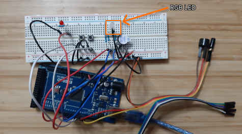

# Blinking and Buzzing

## Overview

This module combines the first 8 lessons of the [ELEGOO MEGA 2560 R3](https://www.amazon.com/ELEGOO-Project-Starter-Compatible-Arduino/dp/B09RDZBY9G?pd_rd_w=1u9gO&content-id=amzn1.sym.ef24cbd7-1c36-4cb3-88ef-bbe71c4409d0&pf_rd_p=ef24cbd7-1c36-4cb3-88ef-bbe71c4409d0&pf_rd_r=V9570KNWAYQ68ZGVH45E&pd_rd_wg=ja2tC&pd_rd_r=5e609cbb-0d72-4dd5-a34e-a091f188b2d2&ref_=sspa_dk_rhf_cart_pt_sub_0&spLa=ZW5jcnlwdGVkUXVhbGlmaWVyPUEzNlk3UjVZTkhHT0JVJmVuY3J5cHRlZElkPUEwNzU0OTg4M05NMVhETDY0MDhWWiZlbmNyeXB0ZWRBZElkPUExMDIwMzM5MklDSlU0OFNDT0dYSyZ3aWRnZXROYW1lPXNwX3JoZl9jYXJ0JmFjdGlvbj1jbGlja1JlZGlyZWN0JmRvTm90TG9nQ2xpY2s9dHJ1ZQ&th=1) [Start up guide](https://images-na.ssl-images-amazon.com/images/I/D1oC-c3G5TS.pdf). I'm stopping this module here because the next lesson uses a lot of pins, so I'm going to need to remove everything currently setup on the board.

## Design

This module combines the first 8 lessons into distinct functions, which can be found at the bottom of the file.

[Link to video giving a tour](https://randommedia.blob.core.windows.net/newcontainer/blinking-buzzing-tour.mp4)

```
  onboardLight();
  lightChanging();
  activeBuzzer();
  passiveBuzzer();
  redLedSwitch();
```

- `onboardLight`: Blinks the onboard light a few times (first lesson. Proves that the board is actually connected and getting uploads from the IDE)<br />
  

- `lightChanging`: Loops change RGB values changing LED color<br />
  

- `activeBuzzer`: Plays a random number of beeps at a random number of pitches<br />
  

- `passiveBuzzer`: Plays a predetermined melody.<br />
  

- `redLedSwitch`: Tilt Ball switch and 2 buttons toggle red LED state off/on. When the Tilt Ball switch moves it turns the LED on.<br />
  

## Lessons Learned

The Arduino can really only do one thing at a time. The way to do event listeners was to sneak a check for events/state in between other logic. The RGB LED light changer did lots of loops. So I had to sneak my event checking logic for the red LED check in for a lot of the loops. The event checks should be more regular. The side effect of fewer checks would be that the red LED state changes seem very delayed. I'd have to hold down a button or shake the Tilt Ball switch for a bit before getting the red LED to show.

## Future dev

I was not able to successfully get VS Code to connect to Arduino and so `git` is screwed up. I followed [this guide](https://blog.devgenius.io/visual-studio-code-arduino-configuration-and-import-solution-a5f188a0cfd0). The problem is that the `.ino` files won't run from VS Code. So I do the Arduino connection and dev in the Arduino IDE.
